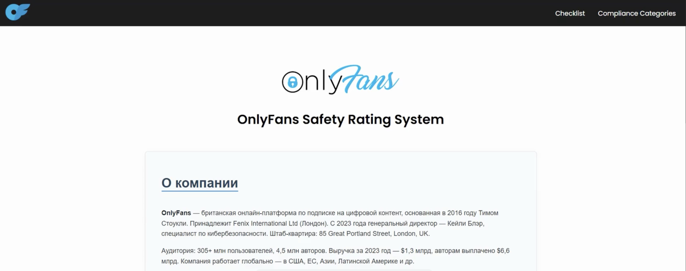

# 📊 ISO 27001 Self-Assessment — OnlyFans Edition

Интерактивное веб-приложение для самооценки уровня информационной безопасности в контексте реальной компании **OnlyFans**, основанное на требованиях международного стандарта **ISO/IEC 27001:2022**.

## Возможности

- Самооценка соответствия контрольным мероприятиям ISO 27001
- Упор на реалии инфраструктуры и риски OnlyFans
- Расчёт процента выполнения и итоговый рейтинг
- Подробные рекомендации по каждому пункту
- Хранение истории прохождения (`localStorage`)
- Очистка и сброс данных
- Кастомный интерфейс: карточки, прогресс-бары, цветовые индикаторы

## Технологии

- HTML5 / CSS3 / JavaScript (Vanilla JS)
- Без внешних фреймворков

## Демо

## Применение

- Учебные и курсовые проекты по информационной безопасности
- Ознакомление с ISO 27001 через реальный кейс (OnlyFans)
- Внутренние самоаудиты в среде, близкой к корпоративной практике

## Особенности адаптации под OnlyFans

- Учтены типичные активы: контент, платёжные данные, S3-хранилища, API
- Вопросы и рекомендации опираются на реальные угрозы и уязвимости платформы
- Соблюдение стандартов: ISO/IEC 27001, GDPR, PCI-DSS, UK Safety Bill

## Автор

Разработано как учебный проект по информационной безопасности.   
[мой GitHub профайл](https://github.com/CozlovschiNichita)

---

**⚠️ Disclaimer:** Проект не является официальным инструментом OnlyFans или ISO, создан исключительно в образовательных целях.
