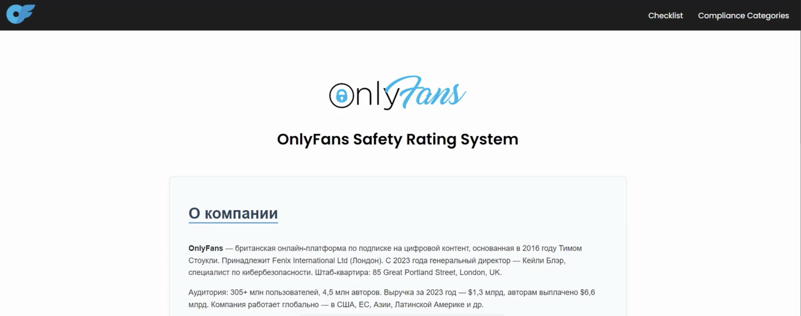

# 📊 ISO 27001 Self-Assessment Web App

Интерактивное веб-приложение для самооценки уровня информационной безопасности по стандарту **ISO/IEC 27001**.

---

## Возможности

- Самооценка по контрольным вопросам ISO 27001
- Расчёт процента выполнения
- Отображение рекомендаций по пропущенным пунктам
- Хранение истории прохождения
- Очистка и сброс данных
- Кастомные элементы UI (карточки)

---

## Технологии

- HTML5 / CSS3 / JavaScript
- Без фреймворков
- Хранение данных в `localStorage`
- Отдельные модули: `questions.js`, `app.js`, `results.js`, `callback.js`

---

## Видео

## Применение

- Учебные и курсовые проекты
- Внутренние аудиты ИБ
- Ознакомление с принципами ISO 27001

## Автор

Разработано как учебный проект по информационной безопасности.   
[мой GitHub профайл](https://github.com/CozlovschiNichita) и [GitHub профайл коллеги](https://github.com/oladia-code)